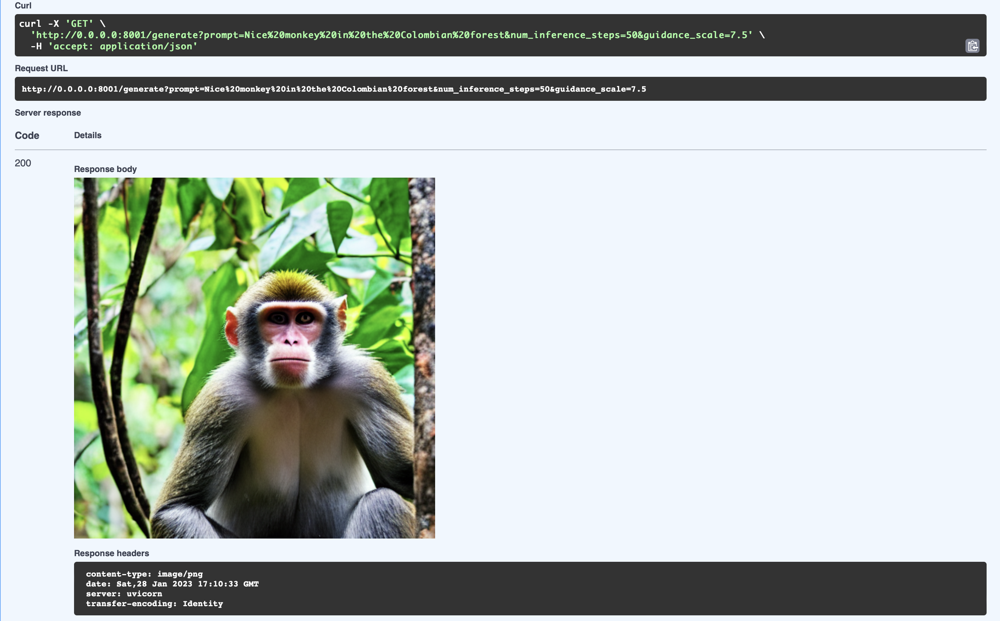

# Stable Diffusion Fastapi
## AI Image Generation Web Application

Welcome to the implementation of a web API that generates images based on [Hugging Face](https://huggingface.co/) stable diffusion models.




**Note**: This repo is based on the work done by [FourthBrain](https://github.com/FourthBrain/FastAPI-for-Machine-Learning-Live-Demo) and [Tiangolo](https://github.com/tiangolo) in this [webinar](https://www.youtube.com/watch?v=_BZGtifh_gw).


## How to Use This Repo

### Dependencies

This implementation was built with Python 3.10 and using Mac M1 GPUs.

Make sure to run

```
pip install -r requirements.txt
pip install --upgrade diffusers transformers scipy
```
Note that you will need a hugging face token, which you can generate [here](https://huggingface.co/settings/tokens). This implementation relies on a .env file, so you need to create this file and put your credentials in there:

```
HF_TOKEN=your_token
```

To launch the application, you can run the following command in your bash terminal:

```
uvicorn main:app --host 0.0.0.0 --port 8000
```

That's it! You can use the api in here: http://0.0.0.0:8000/docs


